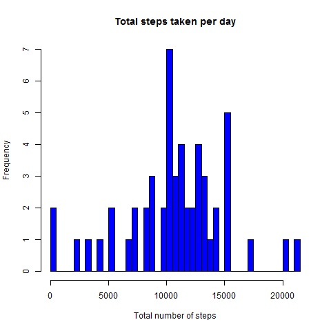
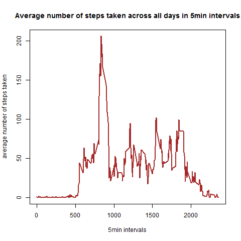
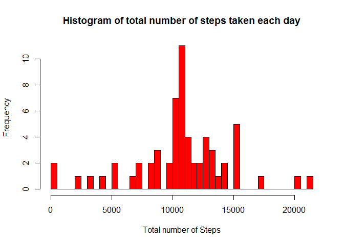
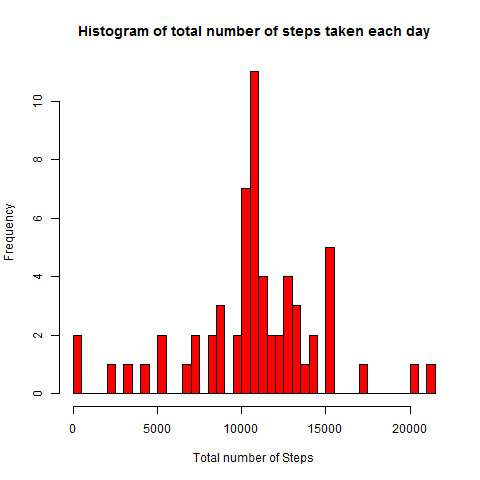
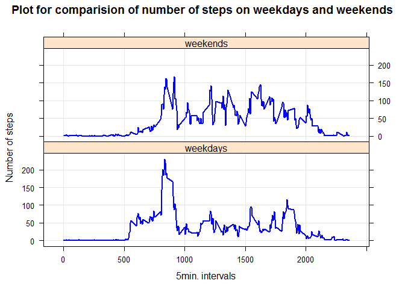
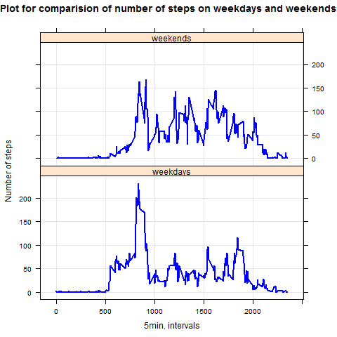

Reproducible Research: peer assignment1
=======================================

Introduction
------------

It is now possible to collect a large amount of data about personal movement using activity monitoring devices such as a Fitbit, Nike Fuelband, or Jawbone Up. These type of devices are part of the "quantified self" movement - a group of enthusiasts who take measurements about themselves regularly to improve their health, to find patterns in their behavior, or because they are tech geeks. But these data remain under-utilized both because the raw data are hard to obtain and there is a lack of statistical methods and software for processing and interpreting the data.

This assignment makes use of data from a personal activity monitoring device. This device collects data at 5 minute intervals through out the day. The data consists of two months of data from an anonymous individual collected during the months of October and November, 2012 and include the number of steps taken in 5 minute intervals each day.

The data for this assignment can be downloaded from the course web site or from the github directory.

Dataset: Activity monitoring data [52K]

### The variables included in this dataset are:

-   **steps:** Number of steps taking in a 5-minute interval (missing values are coded as **NA**)

-   **date:** The date on which the measurement was taken in YYYY-MM-DD format

-   **interval:** Identifier for the 5-minute interval in which measurement was taken

**The dataset is stored in a comma-separated-value (CSV) file and there are a total of 17,568 observations in this dataset.**

------------------------------------------------------------------------

Analysis Details:
-----------------

### Load the required libraries.

``` r
#load required libraries
library(dplyr)
```

    ## Warning: package 'dplyr' was built under R version 3.2.3

    ## 
    ## Attaching package: 'dplyr'

    ## The following objects are masked from 'package:stats':
    ## 
    ##     filter, lag

    ## The following objects are masked from 'package:base':
    ## 
    ##     intersect, setdiff, setequal, union

``` r
library(lattice)
```

------------------------------------------------------------------------

### reading the activity data and pre-processing

``` r
#reading the activity data and pre-processing 
activity <- read.csv('activity.csv', header = TRUE, sep = ",")
activity$date <- as.Date(activity$date)
```

-------------------------------------------
-------------------------------------------

### What is mean total number of steps taken per day?

For this part of the assignment, you can ignore the missing values in the dataset.

**Calculate the total number of steps taken per day**

``` r
###For this part of the assignment, you can ignore the missing values in the dataset.
###Calculate the total number of steps taken per day
activity2 <- group_by(activity,date)
activity2 <- na.omit(activity2)
dailysteps <- summarise(activity2,total_steps = sum(steps))

head(dailysteps)
```

    ## Source: local data frame [6 x 2]
    ## 
    ##         date total_steps
    ##       (date)       (int)
    ## 1 2012-10-02         126
    ## 2 2012-10-03       11352
    ## 3 2012-10-04       12116
    ## 4 2012-10-05       13294
    ## 5 2012-10-06       15420
    ## 6 2012-10-07       11015

``` r
summary(dailysteps)
```

    ##       date             total_steps   
    ##  Min.   :2012-10-02   Min.   :   41  
    ##  1st Qu.:2012-10-16   1st Qu.: 8841  
    ##  Median :2012-10-29   Median :10765  
    ##  Mean   :2012-10-30   Mean   :10766  
    ##  3rd Qu.:2012-11-16   3rd Qu.:13294  
    ##  Max.   :2012-11-29   Max.   :21194

     date             total_steps   

Min. :2012-10-02 Min. : 41
 1st Qu.:2012-10-16 1st Qu.: 8841
 Median :2012-10-29 Median :10765
 Mean :2012-10-30 Mean :10766
 3rd Qu.:2012-11-16 3rd Qu.:13294
 Max. :2012-11-29 Max. :21194

**Make a histogram of the total number of steps taken each day.**

``` r
###Make a histogram of the total number of steps taken each day

#png("plot1.png",width = 480, height = 480)
hist(dailysteps$total_steps,main = "Total steps taken per day",
     xlab = "Total number of steps",col = "blue",
     breaks= length(dailysteps$total_steps)-1,plot = TRUE)
```

<!-- -->

``` r
#dev.off()
```



**Calculate and report the mean and median of the total number of steps taken per day.**

``` r
###Calculate and report the mean and median of the total number of steps taken per day

MeanStepsPerDay <- mean(dailysteps$total_steps)
MedianStepsPerDay <-median(dailysteps$total_steps)
```

\*\*The mean number of steps per day is 10766.19

``` r
MeanStepsPerDay
```

    ## [1] 10766.19

\*\*The median number of steps per day is 10765

``` r
MedianStepsPerDay
```

    ## [1] 10765

-----------------------------------------------
-----------------------------------------------

### What is the average daily activity pattern?

1.  Make a time series plot (i.e. type = "l") of the 5-minute interval (x-axis) and the average number of steps taken, averaged across all days (y-axis)

2.  Which 5-minute interval, on average across all the days in the dataset, contains the maximum number of steps?

**Make a time series plot (i.e. type = "l") of the 5-minute interval (x-axis) and the average number of steps taken, averaged across all days (y-axis)**

``` r
activity3 <- group_by(activity, interval)
activity3 <- na.omit(activity3)
avgsteps_interval <- summarise(activity3, avg_steps = mean(steps)) 
```

``` r
#png("plot2.png",width = 480, height = 480)
plot(avgsteps_interval,type = 'l', col = 'brown',lwd=2,
     main = "Average number of steps taken across all days in 5min intervals",
     xlab = "5min intervals",ylab = "average number of steps taken")
```

<!-- -->

``` r
#dev.off()
```



**Which 5-minute interval, on average across all the days in the dataset, contains the maximum number of steps?**

``` r
maxsteps <- filter(avgsteps_interval, avg_steps == max(avg_steps))
cat(sprintf("At %sth 5min interval, the maximum number of %f steps are found on average on all days in the data set. \n", maxsteps$interval, maxsteps$avg_steps))
```

    ## At 835th 5min interval, the maximum number of 206.169811 steps are found on average on all days in the data set.

**The 835 th 5min interval has the maximum number of steps out of all the 5 minute intervals averaged across all the days in the dataset.**

-----------------------------------------
-----------------------------------------

**Imputing missing values**

Note that there are a number of days/intervals where there are missing values (coded as **NA**). The presence of missing days may introduce bias into some calculations or summaries of the data.

1.  Calculate and report the total number of missing values in the dataset (i.e. the total number of rows with **NA**s)

2.  Devise a strategy for filling in all of the missing values in the dataset. The strategy does not need to be sophisticated. For example, you could use the mean/median for that day, or the mean for that 5-minute interval, etc.

3.  Create a new dataset that is equal to the original dataset but with the missing data filled in.

4.  Make a histogram of the total number of steps taken each day and Calculate and report the **mean** and **median** total number of steps taken per day. Do these values differ from the estimates from the first part of the assignment? What is the impact of imputing missing data on the estimates of the total daily number of steps?

**Calculate and report the total number of missing values in the dataset (i.e. the total number of rows with NAs)**

``` r
missing_steps <- sum(is.na(activity$steps))
missing_date <- sum(is.na(activity$date))
missing_interval <- sum(is.na(activity$interval))

cat(sprintf("Total number of missing values in steps field =  %s\n", missing_steps))
```

    ## Total number of missing values in steps field =  2304

``` r
cat(sprintf("Total number of missing values in date field =  %s\n", missing_date))
```

    ## Total number of missing values in date field =  0

``` r
cat(sprintf("Total number of missing values in interval field =  %s\n",missing_interval))
```

    ## Total number of missing values in interval field =  0

**There are total of 2304 missing values in steps field, 0 missing values in date field, and 0 missing values in interval field. ** \*\*\*\*\*\*\*\*\*\*\*\*\*\*\*\*\*\*

**Devise a strategy for filling in all of the missing values in the dataset. The strategy does not need to be sophisticated. For example, you could use the mean/median for that day, or the mean for that 5-minute interval, etc.**

**Create a new dataset that is equal to the original dataset but with the missing data filled in.**

``` r
#create new dataset with removed NA
activity4<- activity
avgsteps <- summarise(activity3, mean_steps = mean(steps), median_steps = median(steps))

activity4$steps[is.na(activity4$steps)] <- tapply(activity4$steps, activity4$interval, mean, na.rm = TRUE)
```

``` r
#check for any missing values 
sum(is.na(activity4))
```

    ## [1] 0

\*\* There are no more missing values.\*\*

**Make a histogram of the total number of steps taken each day and Calculate and report the mean and median total number of steps taken per day. Do these values differ from the estimates from the first part of the assignment? What is the impact of imputing missing data on the estimates of the total daily number of steps?**

``` r
activity5 <- group_by(activity4, date)
dailysteps_afms <- summarise(activity5,total_steps = sum(steps))

#png("plot3.png",width = 480, height = 480)
hist(dailysteps_afms$total_steps,breaks=length(dailysteps_afms$total_steps)-1, 
     col = 'red', main = "Histogram of total number of steps taken each day",
     xlab = "Total number of Steps",plot = T)
```

<!-- -->

``` r
#dev.off()
```



``` r
new_mean <-mean(dailysteps_afms$total_steps)
new_median <-median(dailysteps_afms$total_steps)

cat(sprintf("The new mean is=  %s\n", new_mean))
```

    ## The new mean is=  10766.1886792453

``` r
cat(sprintf("The new median is =  %s\n", new_median))
```

    ## The new median is =  10766.1886792453

**After removing the NAs, the mean and the median values are same now which is 10766.19.**

------------------------------------------------------------------------

------------------------------------------------------------------------

Are there differences in activity patterns between weekdays and weekends?
-------------------------------------------------------------------------

For this part the weekdays() function may be of some help here. Use the dataset with the filled-in missing values for this part.

1.  Create a new factor variable in the dataset with two levels - "weekday" and "weekend" indicating whether a given date is a weekday or weekend day.

2.  Make a panel plot containing a time series plot (i.e. type = "l") of the 5-minute interval (x-axis) and the average number of steps taken, averaged across all weekday days or weekend days (y-axis). See the README file in the GitHub repository to see an example of what this plot should look like using simulated data.

``` r
activity6<- activity5
activity6$wdays <- weekdays(as.Date(activity6$date))

activity6 <-mutate(activity6, wk.factor = factor((wdays == "Sunday" | wdays == "Saturday"),levels = c(FALSE,TRUE),
                                     labels = c("weekdays","weekends")))

MeanStep_byIntervalByWkday <- aggregate(steps ~ interval + wk.factor, data=activity6, FUN="mean")
```

``` r
#png("plot4.png",width = 480, height = 480)
xyplot(steps ~ interval | wk.factor, data=MeanStep_byIntervalByWkday, type="l", grid=T, layout=c(1,2),
       main="Plot for comparision of number of steps on weekdays and weekends",
       xlab = "5min. intervals", ylab = "Number of steps",lwd = 2,col = "blue")
```

<!-- -->

``` r
#dev.off()
```



------------------------------------------------------------------------

END OF FILE
-----------

------------------------------------------------------------------------
